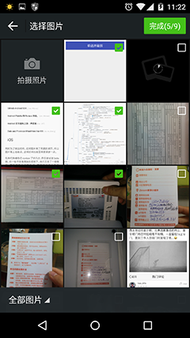
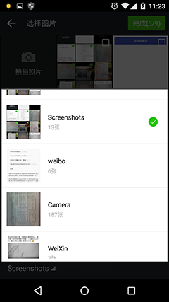
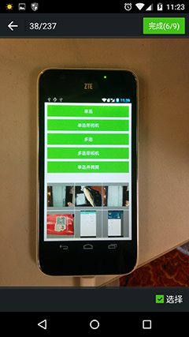
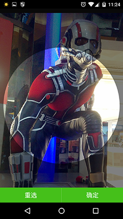

# imagePicker
an imagePicker for android ,with it,you can select single or multiple image,crop it for avatar,take a photo and use it,preview and zoom etc.

-
-
-
-


## Features
 * choosing single or multi image with preview
 * crop a image for avatar simply
 * custom Theme easily.
 * beautiful default demo


## Usage
this referenced two demos to you ,it is very simple.You could also use one of the provide demos but I would strongly suggest that you read the demo code,and make your custom version of this.

### Gradle
```groovy
dependencies {
    compile project(':imagepickerModule')
    compile 'com.nostra13.universalimageloader:universal-image-loader:1.9.3'  //optional
    compile 'com.github.bumptech.glide:glide:3.6.1'   //optional
    compile 'com.squareup.picasso:picasso:2.4.0'   //optional
}
```

### Eclipse
```groovy
it is recommended that you drop eclipse since Android Studio is such a better IDE,
if you insist using eclipse,I think you would be busy with the next steps(change it youself).
```

```java
public class YourActivity extends Activity implements View.OnClickListener,
    AndroidImagePicker.OnPictureTakeCompleteListener,
    AndroidImagePicker.OnImageCropCompleteListener,
    AndroidImagePicker.OnImagePickCompleteListener{

    @Override
    protected void onCreate(Bundle savedInstanceState) {
        super.onCreate(savedInstanceState);
        ...
        ...
        AndroidImagePicker.getInstance().setOnPictureTakeCompleteListener(this);//watching Picture taking
        AndroidImagePicker.getInstance().addOnImageCropCompleteListener(this);
        AndroidImagePicker.getInstance().setOnImagePickCompleteListener(this);

    }

    @Override
    public void onPictureTakeComplete(String picturePath) {
        //your own logic when taking picture is done
    }

    @Override
    public void onImageCropComplete(Bitmap bmp, float ratio) {
        //your own logic when Image Crop is Done
    }

    @Override
    public void onImagePickComplete(List<ImageItem> items) {
        //your own logic when Image pick is Done
    }

    @Override
    protected void onDestroy() {
        AndroidImagePicker.getInstance().deleteOnImagePickCompleteListener(this);
        AndroidImagePicker.getInstance().removeOnImageCropCompleteListener(this);
        AndroidImagePicker.getInstance().deleteOnPictureTakeCompleteListener(this);
        super.onDestroy();
    }

}

```


## Custom
There are three main Activities that you can custom.
* ImageGridActivity[to show all images to pick]
* ImagePreviewActivity[to preview image]
* ImageCropActivity[to crop image]

I would strongly suggest that you read the demo code,and make your custom version of this.

```java
public class ImageGridActivity extends Activity implements AndroidImagePicker.OnImageSelectedListener{

    ImagesGridFragment mFragment;

    @Override
    protected void onCreate(Bundle savedInstanceState) {
        super.onCreate(savedInstanceState);
        ...
        ...
        mFragment = new ImagesGridFragment();
        mFragment.setOnImageItemClickListener(new AdapterView.OnItemClickListener() {
            @Override
            public void onItemClick(AdapterView<?> parent, View view, int position, long id) {
                position = androidImagePicker.isShouldShowCamera() ? position-1 : position;

                if(androidImagePicker.getSelectMode() == AndroidImagePicker.Select_Mode.MODE_MULTI){
                    go2Preview(position);
                }else if(androidImagePicker.getSelectMode() == AndroidImagePicker.Select_Mode.MODE_SINGLE){
                    if(isCrop){
                        Intent intent = new Intent();
                        intent.setClass(PickerActivity.this,CropActivity.class);
                        intent.putExtra(AndroidImagePicker.KEY_PIC_PATH, androidImagePicker.getImageItemsOfCurrentImageSet().get(position).path);
                        startActivityForResult(intent, AndroidImagePicker.REQ_CAMERA);
                    }else{
                        androidImagePicker.clearSelectedImages();
                        androidImagePicker.addSelectedImageItem(position, androidImagePicker.getImageItemsOfCurrentImageSet().get(position));
                        setResult(RESULT_OK);
                        finish();
                    }
                }
            }
        });
        getSupportFragmentManager().beginTransaction().replace(R.id.container, mFragment).commit();
        androidImagePicker.addOnImageSelectedListener(this);

    }

    @Override
    protected void onDestroy() {
        AndroidImagePicker.getInstance().deleteOnImagePickCompleteListener(this);
        AndroidImagePicker.getInstance().removeOnImageCropCompleteListener(this);
        AndroidImagePicker.getInstance().deleteOnPictureTakeCompleteListener(this);
        super.onDestroy();
    }

    ---------------------------------
    when pick completed,you would call:androidImagePicker.notifyOnImagePickComplete(androidImagePicker.getSelectedImages());
    ---------------------------------

}

```


```java
public class ImagePreviewActivity extends Activity implements ImagePreviewFragment.OnImagePageSelectedListener,
    AndroidImagePicker.OnImageSelectedListener{

    ImagePreviewFragment mFragment;
    int mShowItemPosition = 0;

    @Override
    protected void onCreate(Bundle savedInstanceState) {
        super.onCreate(savedInstanceState);
        ...
        ...
        mShowItemPosition = getIntent().getIntExtra(AndroidImagePicker.KEY_PIC_SELECTED_POSITION,0);

        mFragment = new ImagePreviewFragment();
        Bundle data = new Bundle();
        data.putSerializable(AndroidImagePicker.KEY_PIC_PATH, (Serializable) AndroidImagePicker.getInstance().getImageItemsOfCurrentImageSet());
        data.putInt(AndroidImagePicker.KEY_PIC_SELECTED_POSITION, mShowItemPosition);
        mFragment.setArguments(data);

        getSupportFragmentManager().beginTransaction().replace(R.id.container, mFragment).commit();

    }

    @Override
    public void onImagePageSelected(int position, ImageItem item,boolean isSelected) {
        //mTitleCount.setText(position + 1 + "/" + mImageList.size());
        //mCbSelected.setChecked(isSelected);
    }

    @Override
    public void onImageSelected(int position, ImageItem item, int selectedItemsCount, int maxSelectLimit) {
        /**if(selectedItemsCount > 0){
            mBtnOk.setEnabled(true);
            mBtnOk.setText(getResources().getString(R.string.select_complete,selectedItemsCount,maxSelectLimit));
        }else{
            mBtnOk.setText(getResources().getString(R.string.complete));
            mBtnOk.setEnabled(false);
        } **/
    }

    @Override
    protected void onDestroy() {
        androidImagePicker.removeOnImageItemSelectedListener(this);
        super.onDestroy();
    }

    ---------------------------------
    when pick completed,you would call: setResult(RESULT_OK);finish();
    ---------------------------------

}

```


```java
public class ImageCropActivity extends Activity implements ImagePreviewFragment.OnImagePageSelectedListener,
    AndroidImagePicker.OnImageSelectedListener{

    AvatarCropFragment mFragment;
    String imagePath;

    @Override
    protected void onCreate(Bundle savedInstanceState) {
        super.onCreate(savedInstanceState);
        ...
        ...
        imagePath = getIntent().getStringExtra(AndroidImagePicker.KEY_PIC_PATH);

        mFragment = new AvatarCropFragment();
        Bundle data = new Bundle();
        data.putString(AndroidImagePicker.KEY_PIC_PATH,imagePath);
        mFragment.setArguments(data);

        getSupportFragmentManager().beginTransaction().replace(R.id.container, mFragment).commit();

    }


    ---------------------------------
     you would call below when you make cropping:
        ...
        Bitmap bmp = mFragment.getCropBitmap(60*2);
        finish();
        AndroidImagePicker.getInstance().notifyImageCropComplete(bmp,0);
    ---------------------------------

}

```

## Licence

``` text
Copyright (C) 2015 Eason.Lai (easonline7@gmail.com)

Licensed under the Apache License, Version 2.0 (the "License");
you may not use this file except in compliance with the License.
You may obtain a copy of the License at

   http://www.apache.org/licenses/LICENSE-2.0

Unless required by applicable law or agreed to in writing, software
distributed under the License is distributed on an "AS IS" BASIS,
WITHOUT WARRANTIES OR CONDITIONS OF ANY KIND, either express or implied.
See the License for the specific language governing permissions and
limitations under the License.